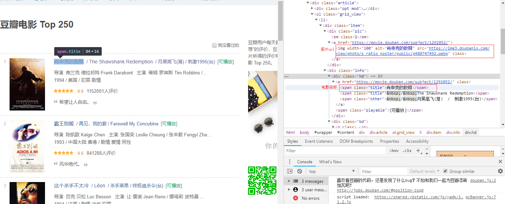

>一个用node.js写的爬取[豆瓣电影top250](https://movie.douban.com/top250)的小demo，只爬取了电影名称、电影评分和电影图片，按页分文件夹存储到了本地
>

## 一、前言
最近在玩儿node.js,为了实践一下，写了个爬取豆瓣电影top250的小demo。之前用python写过几个简单的爬虫，python爬虫网上教程非常多，而且还有许多优秀的模块和成熟的框架加持，所以还是比较简单。而用node写爬虫相对来说就比较少了，node天生异步io效率非常的高其实还是比较适合写爬虫的，但对于node不熟的新手而言node因为天生优势的效率往往会带来很多的坑。原来只接触过java，对python了解一点，第一次接触node.js这种天生异步io的语言，它的效率的确非常的高，为了防止请求太过频繁或者请求速度过快导致被封ip等问题(目前爬豆瓣的数据还没这个问题)，demo的app2.js中还使用了一个async模块(下面会有介绍)来控制并发数量

## 二、运行说明
>运行环境:node v8.11.3

demo主要分为app.js和app2.js,两个文件都可以爬取豆瓣电影top250的所有数据，主要区别在于app2.js中使用了async模块来控制爬取时候的并发数，并通过设置延时来控制爬取速度。
最终会将爬取得到的数据分文件夹保存到本地，包括电影图片和包含电影信息的json格式txt文件。


## 三、快速开始
>git clone git@ASA

>cd ./NodeDouBanSpider

>npm install

>node app.js   或者    node app2.js

## 四、使用了哪些模块
### 1.url
***自带的解析url的模块，通过这个模块可以获取到url的hostname、path、protocol和query等信息:***
```
const URL = require('url')

const baseUrl = 'https://movie.douban.com/top250'
//使用url模块的parse方法将一个url变成一个url对象
let urlObj = URL.parse(baseUrl)
console.log(urlObj)
```
运行结果:
```
Url {
  protocol: 'https:',
  slashes: true,
  auth: null,
  host: 'movie.douban.com',
  port: null,
  hostname: 'movie.douban.com',
  hash: null,
  search: null,
  query: null,
  pathname: '/top250',
  path: '/top250',
  href: 'https://movie.douban.com/top250' }
```
demo主要是使用这个模块取出一个url的hostname和path以及区分是http协议还是https协议
### 2.http/https
***http/https模块非常强大，可以用来搭建HTTP服务端和客户端，在这个demo中主要是用来进行数据请求。***

在豆瓣电影中使用的是https协议，可以结合url模块来判断该require哪个模块(http还是https)
```
//判断是http请求还是https请求
    if (urlObj.protocol == 'http:') {
        var http = require('http')
    }else if(urlObj.protocol == 'https:'){
        var http = require('https')
    }
```
进行数据请求
```
//请求的参数
    const reqOptions = {
        'hostname':urlObj.hostname,
        'path':urlObj.path
    }
    //请求对象
    let req = http.request(reqOptions,response=>{
        if (response.statusCode == 200) {
            var data = []
            response.on('data',buffer=>{
                data.push(buffer)
            })
            //请求结束
            response.on('end',()=>{
            
                if (data) {
                    
                    '''''''
                    下一步解析处理
                }
                
            })
        }else{
            console.log(`请求发生错误:ErrorCode:${res.statusCode}`)
        }
    })

    req.end()
```
其中如果是请求得到网页数据，需要将请求得到的buffer转化成字符串进行下一步解析，如果是使用http/https模块下载图片，则需要将得到的buffer进行拼接并使用fs模块保存至本地
### 3.cheerios
***像jQuery一样解析操作DOM的模块，需要使用npm进行下载***

拿到网页数据后要先分析结构，demo中主要抓取的数据就只有三个：电影名称、评分和图片。

可以看到每部电影的信息都在一个li标签中，电影名称和评分在li标签下的一个class为info的div中，而图片url是在一个class为pic的div中，拿到这两个div的Dom元素后再进一步解析就可以拿到想要的数据了

使用cheerio解析数据:
```
var $ = cheerio.load(data)
    //通过li标签找到电影列表
    var movieList = $('.grid_view').find('li')
    var resultArr = []
    //遍历列表
    movieList.each((index,element)=>{
        let info = $(element).find('.info')
        let pic = $(element).find('.pic')
        const scroe = info.find('.rating_num').text()
        const name = info.find('.title').text()
        const imgUrl = pic.find('a').children('img').attr('src')
        //拿到图片的url后将图片进行下载保存到本地
        getPicBuffer(res,name,imgUrl,page)
        //将所需数据解析并封装成一个json对象
        var result = {
            'name':name,
            'scroe':scroe,
            'imgUrl':imgUrl
        }
        //需要将json对象转换成json格式的字符串放入到数组中
        resultArr.push(JSON.stringify(result))
    })
    //将json数据写入到本地
    writeFile(res,resultArr,page)
```

### 4.fs
***用于读写数据的模块，demo中主要是使用这个模块将json格式的数据和电影图片保存到本地。***
```
//将json格式的数据以txt的形式存入到本地
const writeFile = (dirPath,data,page)=>{
    //文件路径拼接
    let filePath = `${dirPath}/doubanTop250_page${page}.txt`
    fs.writeFile(filePath,data,(err)=>{
        if (err) {
            console.log(`抓取第${page}页失败:${err}`)
        }else{
            console.log(`抓取完毕第${page}页!`) 
        }
    })
}

//将图片数据存到本地
const writePic = (dirPath,name,data,page)=>{
        //图片路径拼接--name有空格和/，需要进行分割并且去除空格
    let picPath = `${dirPath}/${name.split('/')[0].trim()}.jpg`
    fs.writeFile(`${picPath}`,data,(err)=>{
        if (err) {
            console.log(`抓取图片${name}失败:${err}`)
        }
    })

}
```
### 5.async
***一个控制异步处理的模块，需要手动安装，使用详情见--[ 使用async控制并发访问数量](https://www.jianshu.com/p/db81300c2015)***

demo中只有app2.js才使用了async模块

```
//将所有要抓取的url存入到一个数组中
        for(let i = 1;i < count+1;i ++){
            urls.push(baseUrl+`?start=${(i-1)*25}`)
        }

        async.mapLimit(urls,concurrencyCount,(_url,callback)=>{
             var delay=parseInt(2000); //延迟时间
            getBaseData(_url,urls.indexOf(_url)+1)
            .then(res=>{                
                setTimeout(()=>{
                    //没有这个callback循环不会进行下去,_url会全部存到mapLimit失败的回调的result参数中
                    //在成功后必须在callback中传入null或者false---详情见https://www.jianshu.com/p/db81300c2015
                    callback(false,_url)
                },delay)
            }).catch(err=>{
                console.log(err)
            })
        },(err,result)=>{
            console.log(result)
        })
    }
```
### 6.Promise
***Promise不是一个模块，而是es6的新特性中的一个新的构造函数，可以实现链式异步操作，减少callback回调，使用介绍见--# [ES6 Promise 用法讲解](https://www.cnblogs.com/whybxy/p/7645578.html)***

demo中只有少数地方使用了Promise，使用promise不是必须的，只是为了减少callback回调，让代码看起来更简洁、优雅一些(个人理解)

## 五、联系我

**我还是个node萌新，最近在学 习Vue才慢慢接触的node，有什么问题望大家多多指教、共同进步**

#### 我的微信


#### 我的公众号


